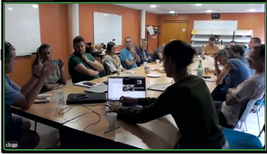

```{r}
#| include: false
library(htmltools)
```

<!-- remove metadata section -->
<style>
  #title-block-header.quarto-title-block.default .quarto-title-meta {
      display: none;
  }
</style>

<!------------------------ Post starts here ------------------------>

Début septembre, l'équipe LeptoNex s'est retrouvée au CBGP pour un nouveau point d'étape, avec au programme : présentation des nouvelles personnes, organisation du terrain et projection sur les mois à venir.

La réunion a commencé par un tour de table des nouveaux et nouvelles membres, avec notamment l'arrivée de collègues de l'ARS Occitanie et de la Métropole (GEMAPI), renforçant encore la dimension interdisciplinaire et partenariale du projet.

Nous avons ensuite travaillé sur l'identification des sites d'étude dans les bassins versants de l'Or et du Lez, et sur l'organisation des campagnes 2025–2026. Un autre temps fort de la réunion a porté sur les stratégies à adopter en cas de détection de leptospires, chez les ragondins ou dans l'environnement. Les échanges ont aussi permis d'avancer sur les questions de partage, d'archivage et de valorisation des données, notamment via l'Infrastructure de Données Géographiques lancée par la métropole de Montpellier.

La réunion a également été l'occasion de présenter les doctorantes recrutées sur le projet pour les quatre prochaines années, avec des thèses en anthropologie, statistique et éco-épidémiologie. Nous souhaitons la bienvenue à Camille Giacomel, Camille Mottier et Julie Blanchet. 

La matinée s'est conclue par une visite des installations du CBGP, du plateau de collections de petits mammifères au laboratoire de génétique. 


