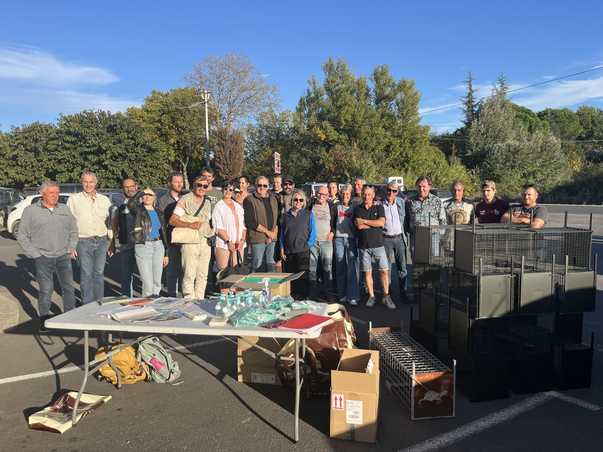
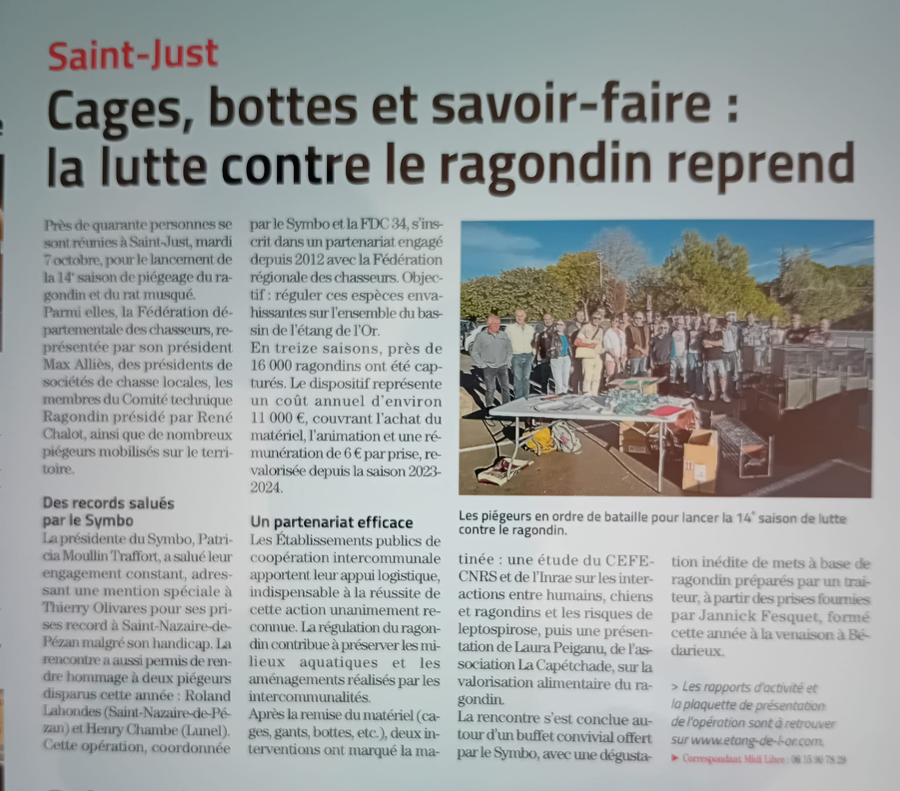

```{r}
#| include: false
library(htmltools)
```

<!-- remove metadata section -->
<style>
  #title-block-header.quarto-title-block.default .quarto-title-meta {
      display: none;
  }
</style>

<!------------------------ Post starts here ------------------------>

Le projet LeptoNex a participé début octobre au comité technique du Symbo consacré au bilan de la campagne de régulation du ragondin autour de l'étang de l'Or et au lancement de la saison 2025–2026.



Ces échanges ont été l'occasion de discuter des résultats de la saison passée, des enjeux opérationnels du piégeage et des perspectives pour l’année à venir, ainsi que du rôle des travaux de recherche menés dans LeptoNex. Les questions soulevées par les acteurs de terrain ont notamment porté sur la contribution des données scientifiques (géolocalisation, structure des populations) à l'appui des actions de gestion.

Cette participation s'inscrit pleinement dans la démarche du projet, fondée sur un dialogue étroit entre recherche, gestionnaires et acteurs locaux, au cœur de l’approche Une seule santé portée par LeptoNex.


