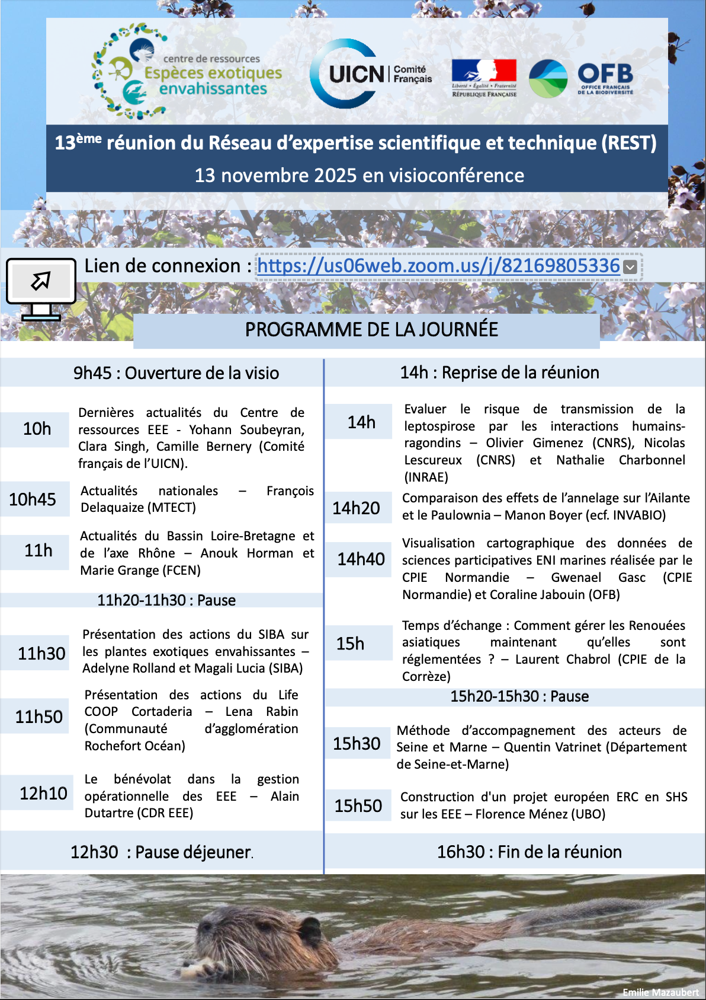
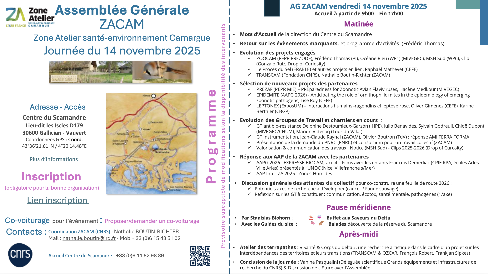
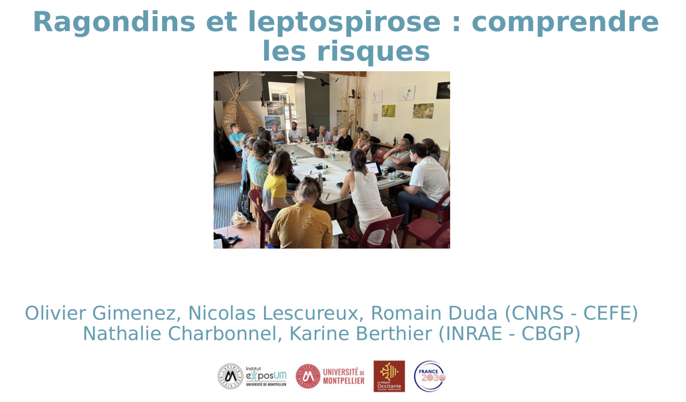

```{r}
#| include: false
library(htmltools)
```

<!-- remove metadata section -->
<style>
  #title-block-header.quarto-title-block.default .quarto-title-meta {
      display: none;
  }
</style>

<!------------------------ Post starts here ------------------------>

L'équipe LeptoNex a été invitée à présenter le projet au cours de deux événements au mois de novembre. 

D'abord le 13 novembre à la 13ème réunion du Réseau d'expertise scientifique et technique sur les espèces exotiques envahissantes (<https://especes-exotiques-envahissantes.fr/reseau-dexpertise-scientifique-et-technique/>)

{width=60%}


Puis le 14 novembre à l'assemblée générale de la zone atelier santé environnement Camargue du CNRS (<https://www.zacam.cnrs.fr/>). 




La présentation du projet peut être consultée en cliquant sur l'image ci-dessous :

[](https://doi.org/10.6084/m9.figshare.30939089.v2)
