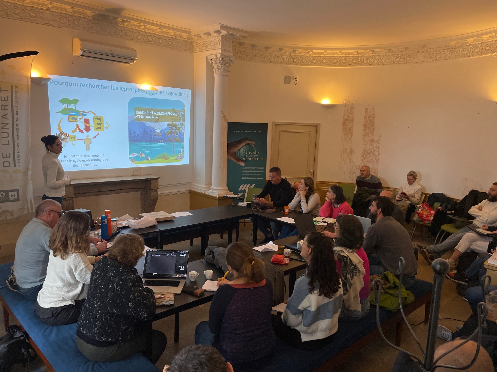

```{r}
#| include: false
library(htmltools)
```

<!-- remove metadata section -->
<style>
  #title-block-header.quarto-title-block.default .quarto-title-meta {
      display: none;
  }
</style>

<!------------------------ Post starts here ------------------------>

L'équipe LeptoNex s'est retrouvée pour une matinée d'échanges autour de l'avancée du projet. 

Après une présentation du projet Grand Parc, nous avons partagé les premiers résultats :  
🦫 les captures de ragondins, la pose des balises GPS et les premiers enseignements sur leurs déplacements,  
🧫 les analyses sur la présence de leptospires chez les ragondins,  
🐕 les avancées côté laboratoire vétérinaire, avec la détection des leptospires chez les chiens (et dans les troupeaux),  
🏥 et les objectifs portés par l'ARS Occitanie autour du groupe Leptospires.  

La fin de matinée a été consacrée aux travaux en socio-anthropologie (observations de terrain, entretiens en cours et à venir), puis à une discussion collective sur les actions d'animation et de sensibilisation prévues pour 2026.

Nous avons terminé sur un moment de convivialité autour d'un pique-nique. 


