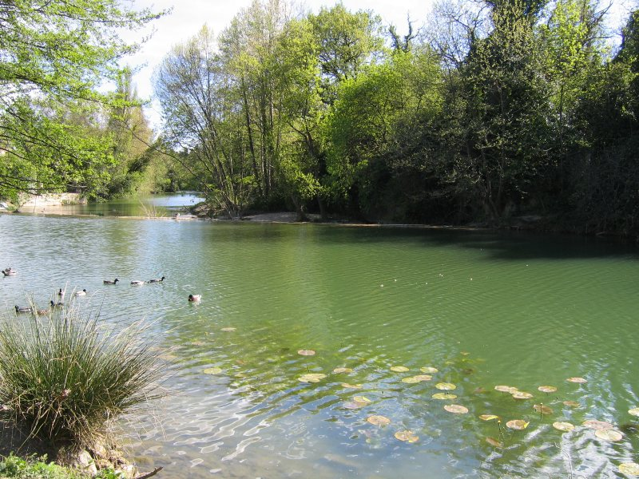
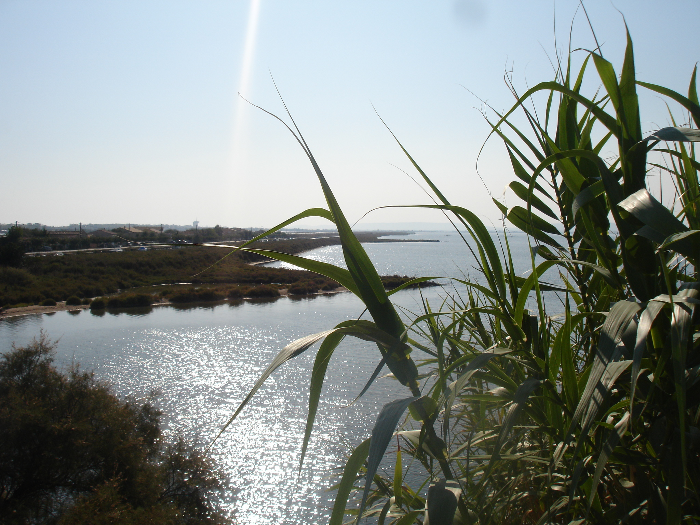
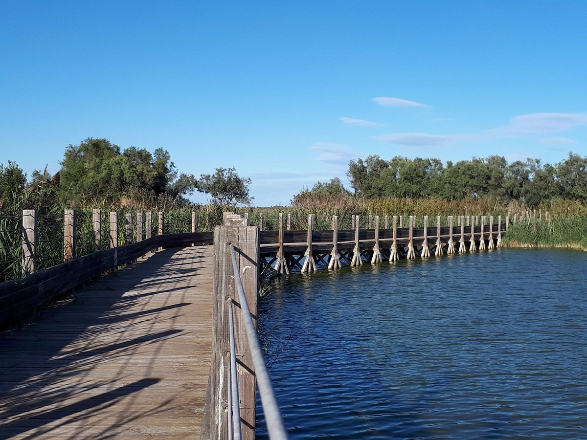

```{r setup}
#| include: false
knitr::opts_chunk$set(echo = FALSE)
```

```{r}
#| include: false
library(htmltools)
source("../R/functions.R")
```

Nous travaillons principalement sur deux bassins versants, le Lez et l'Or. Vous pouvez retrouver plus d'informations sur le site de l'[EPTB du Lez](https://eptb-lez.fr/) et de l'[EPTB de l'Or](https://etang-de-l-or.com/). Un de nos terrains privilégiés est le site du Méjean avec [la Maison de la Nature](https://www.ville-lattes.fr/service-nature/) à Lattes.





